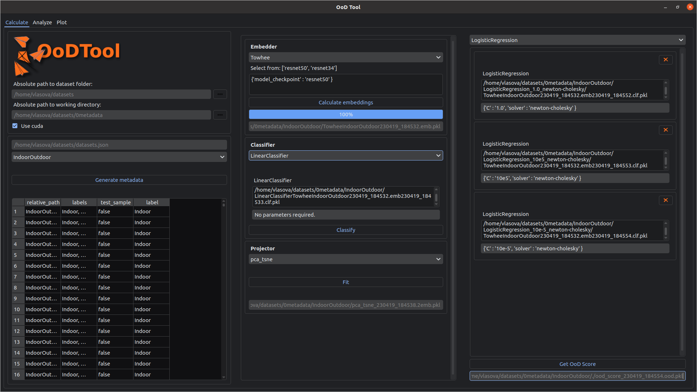
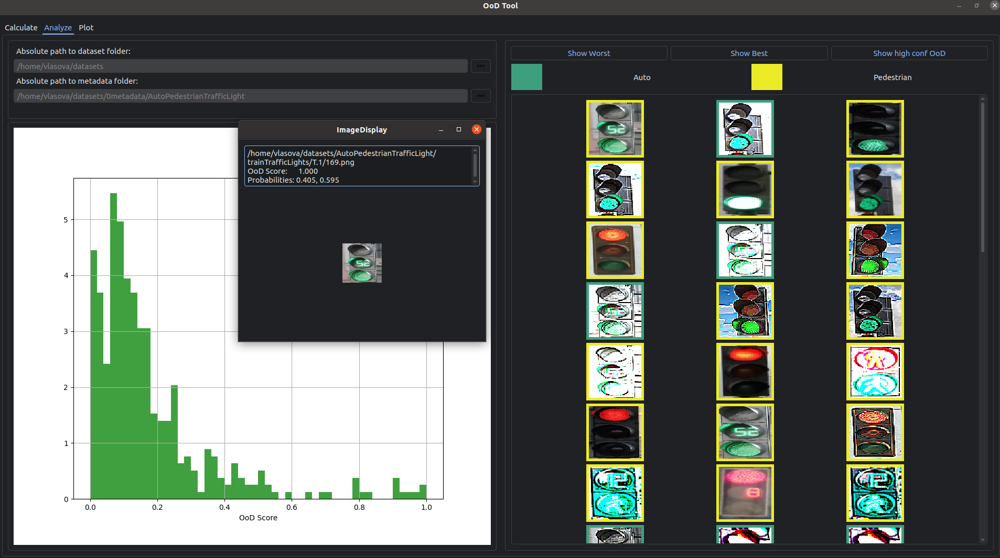
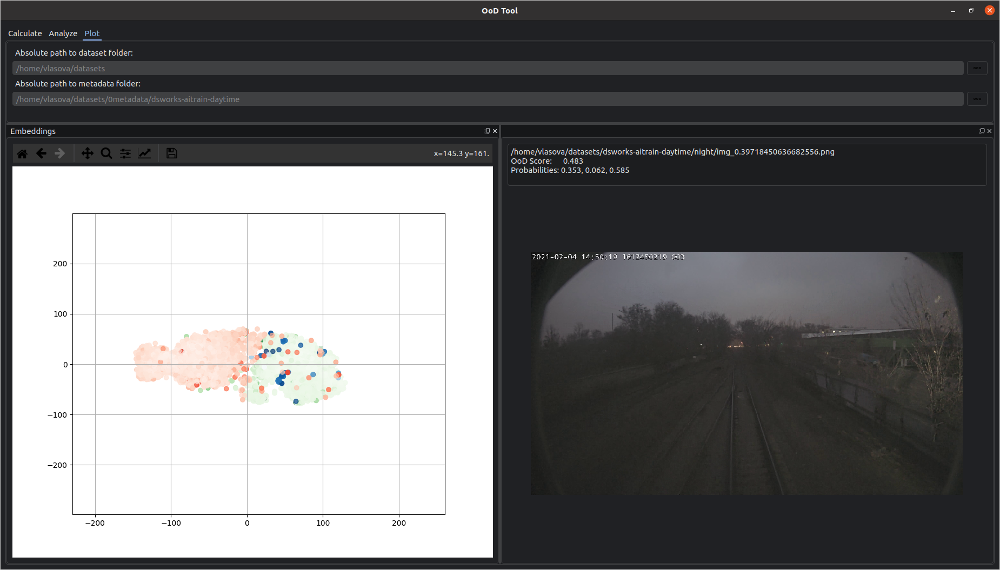
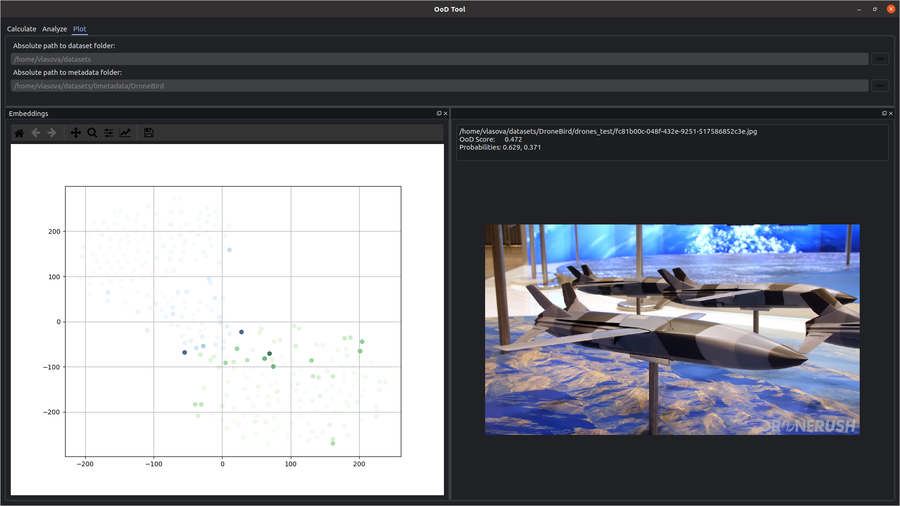

<div align="center">


**Data Exploration Tool**
______________________________________________________________________

## Getting Started

```bash
python3 -m venv ood_env

source ood_env/bin/activate

pip install --upgrade pip

pip install -e .

python3 main.py
```

## What is OoD Tool

Tool for image classification dataset analysis:

### Generate embeddings and predictions for selected data by 
* Using one of supported pretrained models from `timm` deep-learning library (https://timm.fast.ai/)
* Integrating your own embedder model

### Project embeddings to 2D plane: umap, t-SNE, trimap, PCA+t-SNE
### Search nearest neighbours using cosine or euclidian distance
### Calculate OoD Score:

The OoD score of each sample is the entropy of the averaged probability distribution of all classifiers [[1]](#1)

## __Datasets__

* Example datasets can be found [here](./example_data/example_datasets)
* Full datasets: W/box/avlasova/ood_example_datasets 
* Calculated metadata: W/box/avlasova/ood_example_datasets/0metadata

## __Calculate Tab__

In this section the procedure for obtaining the OoD Score is described:

1. Select **root directory for data** (e.g. W/box/avlasova/ood_example_datasets)
2. Select **working directory**, where tool will store all generated metadata (e.g. W/box/avlasova/ood_example_datasets/0metadata)



3. Generate all required metadata. See W/box/box/avlasova/ood_video_howto/ood_calculate.mp4

## __Analyze Tab__

1. Select **root directory for data** (e.g. W/box/avlasova/ood_example_datasets)
2. Select **directory with metadata** (e.g. W/box/avlasova/ood_example_datasets/0metadata/DroneBird/)

See W/box/box/avlasova/ood_video_howto/ood_analyze.mp4





## __Plot Tab__

1. Select **root directory for data** (e.g. W/box/avlasova/ood_example_datasets)
2. Select **directory with metadata** (e.g. W/box/avlasova/ood_example_datasets/0metadata/DroneBird/)

See W/box/box/avlasova/ood_video_howto/ood_analyze.mp4





## References
<a id="1">[1]</a> 
Changjian Chen and Jun Yuan and Yafeng Lu and Yang Liu and Hang Su and Songtao Yuan and Shixia Liu (2020). 
OoDAnalyzer: Interactive Analysis of Out-of-Distribution Samples. https://arxiv.org/abs/2002.03103
