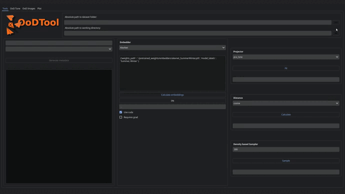
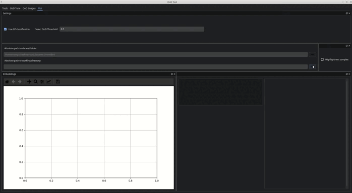

<div align="center">


**Data Exploration Tool**
______________________________________________________________________

## Getting Started

</div>

```bash
python3 -m venv ood_env

source ood_env/bin/activate

pip install --upgrade pip

pip install -e .
```

Example dataset can be found [here](./example_data/DogsCats)

If you would like to launch all scripts from console, please see [OoDTool core](./tool/core/README.md).
Otherwise, let's go:

```bash
python3 launch_gui.py
```

### Get features

First, generate metadata for your dataset and calculate features.
You can select one of pretrained ResNet or Densenet weights from timm library ([more info](./tool/core/model_wrappers/README.md)).
Or provide path to pretrained checkpoint. Gradients calculation and storage are required only if you
would like to see saliency maps for chosen model. Otherwise, uncheck it, since it slows down inference significantly.
All generated `.emb.pkl` files will be stored in current session folder.


https://github.com/anastasia-spb/OoDTool/blob/main/readme_data/embeddings.mp4


### Get OoDScore

In the "OoD Tune" tab you can create you own ensemble of linear classifiers, set weight decays and calculate
ood score for each sample in your dataset.


https://github.com/anastasia-spb/OoDTool/blob/main/readme_data/entropy_score.mp4

### Pairwise distances and 2D projection

In your session folder leave only one `.emb.pkl` file. You can put other files in a new folder.
Come back to "Tools" tab, select pdist and projection methods and run widgets.


https://github.com/anastasia-spb/OoDTool/blob/main/readme_data/pdist_and_projection.mp4

### Sampler

In case you have too many samples (above 1000), it's recommended to subsample your dataset.
In your session folder leave only one `.emb.pkl` file. You can put other files in a new folder.
Select desired number of samples and run sampler widget. Open your session folder and move
origin `.emb.pkl` into a folder.
Come back to "Tools" tab, select pdist and projection methods and run widgets.


https://github.com/anastasia-spb/OoDTool/blob/main/readme_data/sampled_pdist_and_projection.mp4

### OoD Images

In this tab you can sort dataset images by OoDScore and also by confidence (descending order) which
have OoD score above selected threshold. 

Notes about dataset in video: "DronesBirds" training dataset contained red birds and none of red drone,
images where a human and drone together, none of human+bird samples. On this video we demonstrate
e.g. that for red drones we might get wrong classification results with high confidence, but with high
OoD score as well.


https://github.com/anastasia-spb/OoDTool/blob/main/readme_data/visualize.mp4

### Plot

Plot projected embeddings, highlight images with high OoD score, 
visualize train/test sets overlap, show misclassified samples if you `.emb.pkl` contains meaningful predicted probabilities.


https://github.com/anastasia-spb/OoDTool/blob/main/readme_data/plot.mp4