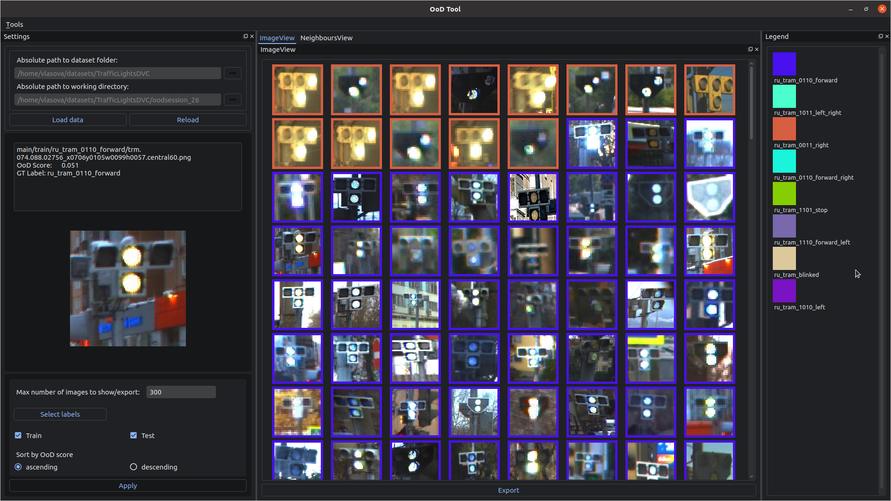

<div align="center">


**Data Exploration Tool**
______________________________________________________________________

## Getting Started

</div>

### Ubuntu


```bash
python3 -m venv ood_env

source ood_env/bin/activate

pip config set global.extra-index-url 'https://gitlab.cognitivepilot.com/api/v4/projects/347/packages/pypi/simple'

pip install --upgrade pip

pip install oodtool
```

_Troubleshooting_
  > * Error: Could not load the Qt platform plugin "xcb"
  >   Solution: 
  >   ```bash
  >   pip3 uninstall opencv-python
  >   pip3 install --no-binary opencv-python opencv-python
  >   ```

### Windows

```bash
pip install virtualenv

virtualenv --python C:\Path\To\Python\python.exe ood_env

.\ood_env\Scripts\activate

pip install --upgrade pip

pip install oodtool --extra-index-url "https://gitlab.cognitivepilot.com/api/v4/projects/347/packages/pypi/simple"

```

_Troubleshooting_
  > * Error: Could not run 'aten::*' with arguments from the 'CUDA' backend.
  >   Solution - use CPU: 
  >   ```bash
  >   pip install oodtool --extra-index-url "https://gitlab.cognitivepilot.com/api/v4/projects/347/packages/pypi/simple" --extra-index-url "https://download.pytorch.org/whl/cpu"
  >   ```

Example dataset can be found [here](./example_data/DogsCats)

```bash
python -m oodtool
```



