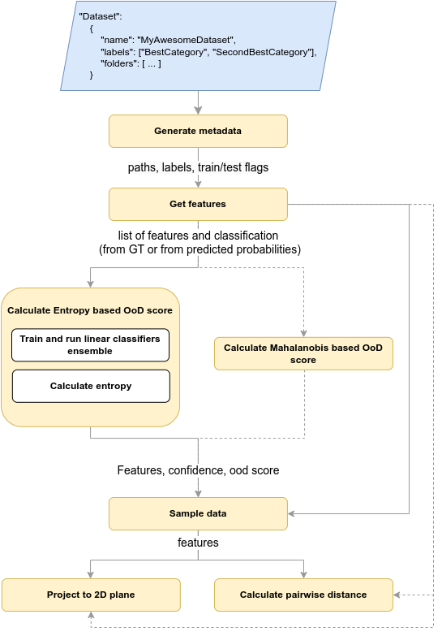
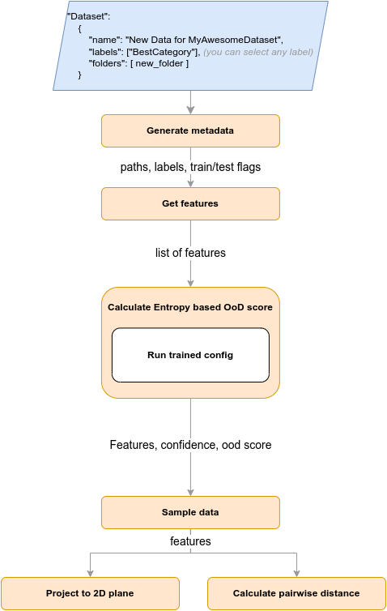

# Data Exploration Tool. Core package.
______________________________________________________________________

#### Core package includes python scripts, which help with data exploration.

## Table of Contents

1. [Metadata generator](metadata_generator/README.md)
2. [Models for inference](model_wrappers/README.md)
3. [Simple classifiers](classifier_wrappers/README.md)
4. [OoD Score based on classification results and entropy](ood_entropy/README.md)
5. [OoD Score based on embeddings and mahalanobis distance](ood_mahalanobis/README.md)
6. [Density based sample](density_based_sampler/README.md)
7. [Data projectors to 2D](data_projectors/README.md)
8. [Pairwise distance calculator](distance_wrapper/README.md)

## Pipeline

Scenario 1:
I have labelled dataset and would like to visualize its projection and search for samples high OoD Score

Scenario 2:
I have new unlabelled data for my dataset, which was previously analyzed in OoDTool 

